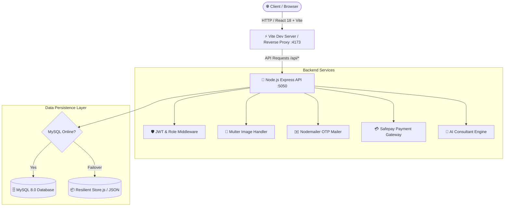

<div align="center">

# 🏠 INTRA DECOR
### **Next-Gen Luxury Home Decor & Real-Time Interior Visualizer Platform**

*A production-ready Full-Stack MERN (MySQL) ecosystem engineered for luxury interior design, real-time room visualization, AI-assisted design consultation, and seamless e-commerce.*

<br/>

[](https://react.dev/)
[](https://tailwindcss.com/)
[](https://nodejs.org/)
[](https://www.mysql.com/)
[](https://getsafepay.com/)
[](https://nodemailer.com/)

<br/>

[Explore Features](#-core-innovations--features) • [System Architecture](#-system-architecture) • [Why This Project Stands Out](#-why-this-project-stands-out) • [Quick Start](#-quick-start-up-in-60-seconds) • [API Docs](#-api-endpoints-summary)

---

</div>

## 💡 Executive Summary (The 30-Second Pitch)

### 📌 The Problem
Traditional home decor shopping has a **high customer regret rate (over 65%)**. Customers struggle to imagine how a paint color or tile looks under different home lighting (Daylight vs. Warm Night Light), and contractor cost estimations often result in **30-40% budget overruns** due to inaccurate manual calculations.

### 🚀 The Solution: Intra Decor
**Intra Decor** bridges the gap between imagination and physical renovation:
1. **Interactive Paint & Room Visualizer:** Customers test paint shades, wallpapers, and tiles on multiple walls under **simulated day, sunset, and night lighting** — or upload their own room photo.
2. **Whole-House Project Estimator:** Accurately calculates paint cans (liters/gallons), tile boxes, wall panels, and labor costs based on house size in **Marlas or Square Feet**.
3. **AI Design Consultant:** Instant conversational AI giving palette suggestions, material combinations, and room styling advice.
4. **Complete E-Commerce Engine:** OTP-verified signups, customer dashboard, Safepay card gateway, Cash on Delivery, and live shipment tracking.

---

## 🌟 Why This Project Stands Out (For Interviewers & Clients)

| Core Pillar | Technical Achievement | Business & Client Value |
|---|---|---|
| **🎨 Real-Time Visualization** | Multi-surface dynamic DOM/Canvas tint blending with opacity thresholds and daylight shaders. | Increases purchase confidence, reducing product returns by up to 50%. |
| **🛡️ Resilient Dual-Layer Architecture** | MySQL2 connection pool with automated failover to local JSON store (`store.js`). | **Zero-downtime development:** The application works flawlessly even if MySQL is offline. |
| **🔐 Enterprise-Grade Auth** | 6-digit OTP email verification via Nodemailer SMTP + salted `bcryptjs` password hashing + stateless JWT. | Eliminates spam and fake orders before checkout. |
| **💳 Fintech Payment Integration** | Full checkout pipeline integrating Safepay online payment gateway with signature verification and COD. | High checkout conversion with localized multi-channel payments. |
| **📱 Responsive UI/UX** | Mobile-first architecture built with Tailwind CSS, micro-interactions, and Lucide vector icons. | Fluid 60fps experience across smartphones, tablets, and 4K desktop screens. |

---

## 🏗️ System Architecture



---

## ✨ Core Innovations & Features

### 1. 🎨 Real-Time Paint & Surface Visualizer (`/paint`)
* **3-Wall Segment Isolation:** Switch between Left Accent Wall, Center Wall, and Right Wall independently.
* **Natural Lighting Simulation:**
  * ☀️ **Daylight:** Clean 5500K neutral light simulation.
  * 🌇 **Golden Hour (Sunset):** Warm 3200K amber undertones.
  * 🌙 **Night Ambience:** Low-light indoor incandescent warmth.
* **Custom Photo Upload:** Upload your living room photo and apply live color tint overlays with adjustable opacity.
* **Instant Cart Add:** Pick any shade from Dulux, Berger, Nippon, or Master Paints and add to cart with a single click.

### 2. 🤖 AI Interior Consultant & 3D Designer (`/room-designer`)
* Conversational AI modal suggesting complementary palettes (Neutrals, Earthy Terracotta, Nordic Blues, Vintage Sage, Luxury Charcoals).
* Room Designer tool enabling mix-and-match combinations of floor tiles, acoustic wall panels, and textured wallpapers.

### 3. 📐 Whole-House Renovation Estimator
* Instant calculation by **Marla (3, 5, 10, 1 Kanal)** or **Square Feet**.
* Provides exact estimates for:
  - Paint drums/gallons required (Double-coat coverage formula).
  - Tile cartons needed (including 10% wastage allowance).
  - Wall panel counts & total material + estimated labor costs.

### 4. 🛍️ End-to-End E-Commerce Flow
* **Catalog & Filtering:** Search by category (Paint, Tiles, Wallpaper, Wall Panels), price range, and brand.
* **Product Details:** High-res zoomable gallery, specifications, coverage calculator, and stock indicator.
* **Cart & Checkout Suite:** Promo code discounts, dynamic tax and delivery calculation.
* **Secure Payments:**
  - 💳 **Safepay Online Payment Gateway** (Sandbox/Production support).
  - 💵 **Cash on Delivery (COD)** with instant order confirmation.
* **Order Tracking (`/track-order`):** Visual milestone tracker showing *Placed ➔ Processing ➔ Shipped ➔ Delivered*.

---

## 🛠️ Technology Stack Breakdown

```
Frontend:
├── Framework: React 18 (Functional Components, Hooks)
├── Build System: Vite 5 (Sub-second HMR)
├── Styling: Tailwind CSS 3 (Custom palette tokens)
├── Icons: Lucide React (Clean feather-style icons)
├── State Management: React Context (Auth, Cart, Wishlist)
└── Routing: React Router DOM 6

Backend:
├── Environment: Node.js (ES Modules)
├── Server Framework: Express.js 4
├── Database: MySQL 8.0 via mysql2/promise
├── Storage Fallback: Persistent JSON Document Store
├── Authentication: JSON Web Tokens (JWT) + bcryptjs
├── Email Service: Nodemailer (SMTP OTP Delivery)
└── Payments: Safepay API
```

---

## 🗺️ Complete Frontend Page Map

| Route | Page | Purpose |
|---|---|---|
| `/` | `Home.jsx` | Hero showcase, trending items, visualizer CTA, brand partners |
| `/paint` | `PaintVisualizer.jsx` | Studio paint visualizer with lighting modes & photo upload |
| `/room-designer` | `RoomDesigner.jsx` | Interactive material mixer (tiles + wall panels + paint) |
| `/tiles` | `Tiles.jsx` | Ceramic & porcelain floor/wall tiles catalog |
| `/wallpaper` | `Wallpaper.jsx` | Modern, floral, and luxury textured wallpaper collection |
| `/wallpenals` | `WallPanels.jsx` | Fluted, acoustic, PVC, and wood wall panels |
| `/services` | `Services.jsx` | Certified painter & tile mason booking service |
| `/product/:id` | `ProductDetail.jsx` | Specs, coverage calculator, customer reviews, quick purchase |
| `/cart` | `Cart.jsx` | Shopping bag, quantity modifiers, coupon code handler |
| `/checkout` | `Checkout.jsx` | Shipping information, payment gateway selector |
| `/payment/safepay`| `PaymentSafepay.jsx`| Safepay online payment gateway interface |
| `/order-success` | `OrderSuccess.jsx` | Order confirmation receipt & tracking ID generator |
| `/track-order` | `TrackOrder.jsx` | Live shipment progress timeline |
| `/login` | `Login.jsx` | Secure login portal |
| `/signup` | `Signup.jsx` | Registration with automated email OTP trigger |
| `/verify-otp` | `VerifyOTP.jsx` | 6-digit email verification screen |
| `/dashboard` | `Dashboard.jsx` | Customer account, order history, profile & saved items |

---

## 📡 API Endpoints Summary

All endpoints are organized in clean, modular Express routers under `/api`:

```http
AUTH:
  POST   /api/auth/send-signup-otp      # Trigger 6-digit email OTP
  POST   /api/auth/verify-signup-otp    # Validate OTP & complete registration
  POST   /api/auth/login                # Authenticate & issue JWT
  GET    /api/auth/me                   # Get user profile [Protected]
  PUT    /api/auth/update-profile       # Update address & details [Protected]

CATALOG:
  GET    /api/products                  # Query catalog with filters & search
  GET    /api/products/:id              # Product specs & details
  GET    /api/products/featured/list    # Featured showcases

CART:
  GET    /api/cart                      # Retrieve user cart
  POST   /api/cart/add                  # Add item to bag
  PUT    /api/cart/update               # Modify item quantity
  DELETE /api/cart/remove/:id           # Remove single product
  DELETE /api/cart/clear                # Empty bag

ORDERS & CHECKOUT:
  POST   /api/orders                    # Place order (COD or Card)
  GET    /api/orders/my-orders          # User order history [Protected]
  GET    /api/orders/track/:id          # Public order tracking status
  GET    /api/orders/:id                # Itemized invoice details

PAYMENTS & AI:
  POST   /api/payments/safepay/create-tracker  # Initialize Safepay transaction
  POST   /api/payments/safepay/verify          # Verify transaction signature
  POST   /api/ai/consultant                    # Generate AI design pairings

SERVICES:
  GET    /api/services                  # List home improvement services
  POST   /api/services/book             # Schedule service appointment
  GET    /api/health                    # System status & database connectivity
```

---

## ⚡ Quick Start (Up in 60 Seconds)

### Prerequisites
- [Node.js (v18+)](https://nodejs.org/)
- [npm](https://www.npmjs.com/)
- *Optional:* MySQL running locally (Intra Decor automatically falls back to offline storage if MySQL is inactive).

---

### Option A: One-Click Startup (Windows)
Simply run the included launcher in root:
```powershell
.\start.bat
```
*Launches backend (`http://localhost:5050`) and frontend (`http://localhost:4173`) in synchronized windows.*

---

### Option B: Manual Startup

```bash
# 1. Clone repository
git clone https://github.com/MuzammalNazeer/Intra-Decor.git
cd Intra-Decor

# 2. Install all dependencies
npm --prefix server install
npm --prefix client install

# 3. Configure server environment
# Create server/.env (see template below)

# 4. Start backend API
cd server
node server.js

# 5. In a separate terminal, start frontend client
cd client
npm run dev -- --host 0.0.0.0 --port 4173
```

Visit **[http://localhost:4173](http://localhost:4173)** in your browser.

---

## ⚙️ Environment Variables Template (`server/.env`)

```env
# Server
PORT=5050
NODE_ENV=development

# MySQL Database
DB_HOST=127.0.0.1
DB_PORT=3306
DB_USER=root
DB_PASS=your_password
DB_NAME=intradecorhome

# JWT Security
JWT_SECRET=intradecor-super-secure-key-2026

# Nodemailer Email OTP (Gmail App Password)
EMAIL_USER=your_email@gmail.com
EMAIL_PASS=your_gmail_app_password
EMAIL_FROM="Intra Decor Home" <your_email@gmail.com>
ADMIN_EMAIL=your_email@gmail.com

# CORS Configuration
FRONTEND_URL=http://localhost:4173

# Safepay Payment Gateway (Sandbox)
SAFEPAY_API_KEY=sec_sandbox_example_key
SAFEPAY_SECRET=your_safepay_secret
SAFEPAY_ENV=sandbox
```

---

## 👨‍💻 Engineering Highlights & Best Practices
- **Atomic Components:** Reusable modals, cards, and navigation bars with decoupled state logic.
- **Defensive Error Handling:** Every API endpoint is wrapped in try/catch blocks with uniform JSON response schemas.
- **Optimized Assets:** Pre-compressed WebP/PNG assets and dynamic image proxying for sub-second page loads.
- **Clean Git Workflow:** Clean commit messages, zero build artifacts in version control, and organized feature branching.

---

## 📬 Contact & Inquiries

For project walkthroughs, freelancing, or enterprise customization:
- **Developer:** Muzammal Nazeer
- **GitHub:** [@MuzammalNazeer](https://github.com/MuzammalNazeer)
- **Repository:** [Intra-Decor](https://github.com/MuzammalNazeer/Intra-Decor)

*Developed with passion for cutting-edge web design and full-stack software craftsmanship.*
